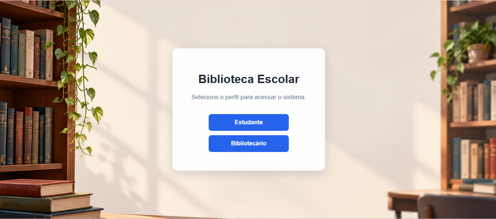
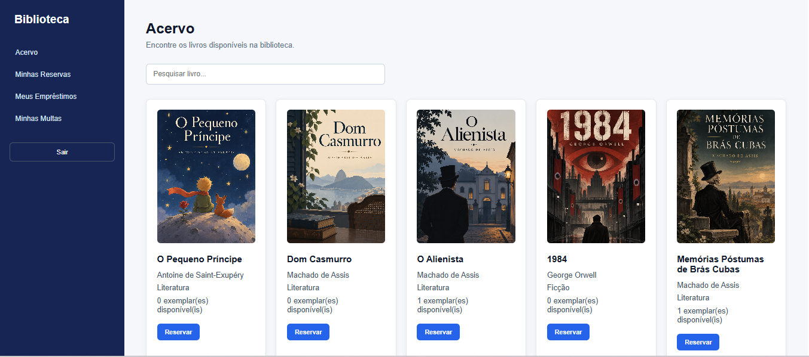
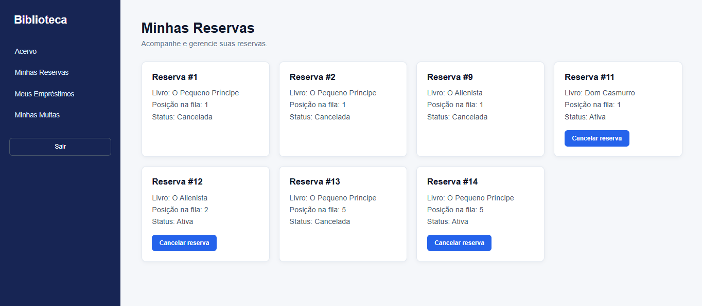
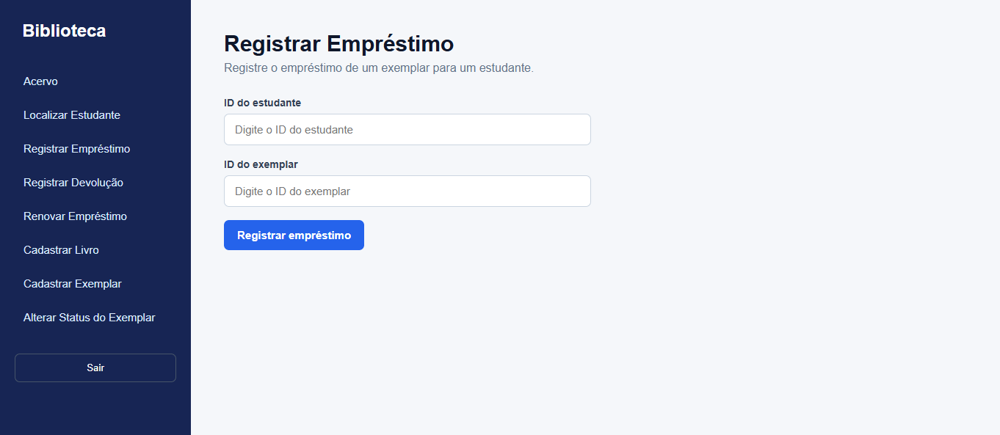

# 📚 Sistema de Gerenciamento de Biblioteca Escolar

Sistema web full stack desenvolvido para simular o gerenciamento de uma biblioteca escolar, permitindo o controle de livros, exemplares, estudantes, empréstimos, reservas, devoluções, renovações e multas.

O projeto foi desenvolvido como parte do meu portfólio durante a graduação em Análise e Desenvolvimento de Sistemas, com o objetivo de aplicar na prática conceitos de desenvolvimento web, APIs REST, Programação Orientada a Objetos, banco de dados relacional e regras de negócio.

---

## 🖥️ Demonstração

### Seleção de perfil

O sistema possui interfaces distintas para estudantes e bibliotecários.



### Acervo do estudante

O estudante pode consultar o catálogo, visualizar a disponibilidade dos exemplares e realizar reservas.



### Gerenciamento de reservas

As reservas possuem controle de status e posição na fila, além da possibilidade de cancelamento.



### Área do bibliotecário

O bibliotecário possui acesso às operações administrativas da biblioteca, como registro de empréstimos, devoluções, renovações e gerenciamento do acervo.



---

## 🎯 Objetivo

Desenvolver uma aplicação capaz de centralizar operações comuns de uma biblioteca escolar, oferecendo funcionalidades específicas para estudantes e bibliotecários.

O sistema foi construído de forma incremental, passando pelas etapas de levantamento de requisitos, modelagem, desenvolvimento do backend, integração com banco de dados e construção da interface web.

---

## 👤 Área do Estudante

O estudante pode:

- Consultar o acervo da biblioteca
- Pesquisar livros por título, autor ou categoria
- Visualizar a quantidade de exemplares disponíveis
- Reservar livros
- Consultar suas reservas
- Cancelar reservas
- Consultar seus empréstimos
- Consultar multas

---

## 🧑‍💼 Área do Bibliotecário

O bibliotecário pode:

- Consultar o acervo
- Localizar estudantes
- Registrar empréstimos
- Registrar devoluções
- Renovar empréstimos
- Cadastrar livros
- Cadastrar exemplares
- Alterar o status de exemplares

---

## ⚙️ Regras de Negócio

Entre as regras implementadas estão:

- Empréstimos possuem prazo padrão de 7 dias
- A renovação acrescenta 7 dias ao prazo atual
- Exemplares emprestados ficam automaticamente indisponíveis
- A devolução torna o exemplar disponível novamente
- Atrasos podem gerar multa de R$ 1,00 por dia
- Um estudante não pode manter duas reservas ativas para o mesmo livro
- Cada livro possui limite de 5 reservas ativas
- Livros e exemplares são entidades independentes, permitindo que um livro possua múltiplos exemplares

---

## 🛠️ Tecnologias

### Backend

- C#
- .NET
- ASP.NET Core Web API
- Entity Framework Core

### Banco de Dados

- SQL Server
- SQL Server Management Studio (SSMS)

### Frontend

- HTML
- CSS
- JavaScript
- Fetch API

### Versionamento

- Git
- GitHub

---

## 🏗️ Arquitetura

O projeto utiliza uma arquitetura organizada em responsabilidades, separando a interface, os endpoints da API, as regras de negócio e o acesso aos dados.

```text
Frontend
   ↓
Controllers
   ↓
Services
   ↓
Entity Framework Core
   ↓
SQL Server
```

### Backend

```text
Biblioteca.Api/
├── Controllers/
├── Data/
├── DTOs/
├── Exceptions/
├── Migrations/
├── Models/
└── Services/
```

A comunicação entre o frontend e o backend é realizada por meio de requisições HTTP utilizando a Fetch API.

---

## 🗃️ Banco de Dados

O banco de dados relacional contém entidades responsáveis por representar os principais elementos do domínio da biblioteca:

- Estudantes
- Turmas
- Bibliotecários
- Livros
- Exemplares
- Empréstimos
- Reservas
- Multas

O Entity Framework Core é utilizado para realizar o mapeamento entre as entidades da aplicação e o SQL Server, além do gerenciamento das alterações do banco por meio de migrations.

---
## ▶️ Como executar o projeto

### Pré-requisitos

Para executar o projeto localmente, é necessário ter instalado:

- .NET SDK
- SQL Server
- SQL Server Management Studio (opcional)
- Visual Studio Code ou outra IDE de sua preferência
- Extensão Live Server para executar o frontend

### 1. Clone o repositório

```bash
git clone https://github.com/GioLiesenfeld/Sistema-Biblioteca.git
cd Sistema-Biblioteca
```

### 2. Configure o banco de dados

A aplicação utiliza SQL Server. A string de conexão padrão está configurada em:

```text
backend/Biblioteca.Api/appsettings.json
```

Configuração utilizada no desenvolvimento:

```text
Server=localhost;Database=BibliotecaDb;Trusted_Connection=True;TrustServerCertificate=True;
```

Caso necessário, altere a string de conexão de acordo com a sua instalação do SQL Server.

### 3. Aplique as migrations

Acesse a pasta da API:

```bash
cd backend/Biblioteca.Api
```

Execute:

```bash
dotnet ef database update
```

### 4. Execute o backend

```bash
dotnet run
```

A API será iniciada localmente.

### 5. Execute o frontend

Abra a pasta do projeto no Visual Studio Code e execute o arquivo:

```text
frontend/index.html
```

utilizando a extensão **Live Server**.

Durante o desenvolvimento, o frontend foi executado em:

```text
http://127.0.0.1:5500
```

> O projeto utiliza CORS configurado para esse endereço durante a execução local.

## 🔗 Principais endpoints

### Livros

```text
GET  /api/livros
POST /api/livros
```

### Exemplares

```text
POST /api/exemplares
PUT  /api/exemplares/{id}/status
```

### Empréstimos

```text
POST /api/emprestimos
POST /api/emprestimos/{id}/devolucao
POST /api/emprestimos/{id}/renovacao
GET  /api/emprestimos/estudante/{id}
```

### Reservas

```text
POST /api/reservas
POST /api/reservas/{id}/cancelamento
GET  /api/reservas/estudante/{id}
```

### Multas

```text
GET /api/multas/estudante/{id}
```

### Estudantes

```text
GET /api/estudantes/busca?termo=...
```

---

## 📂 Documentação

O repositório também contém a documentação produzida durante o desenvolvimento do projeto, incluindo:

- Visão do produto
- Requisitos
- Casos de uso
- Diagrama de casos de uso
- Modelo de domínio
- Arquitetura
- Backend
- Frontend

Os documentos estão disponíveis na pasta [`docs`](docs/).

---

## 🚀 Próximos Passos

Algumas melhorias planejadas para versões futuras:

- Implementação de autenticação
- Identificação automática do usuário autenticado
- Armazenamento seguro de senhas
- Melhorias adicionais de responsividade
- Evolução da interface e experiência do usuário

---

## 📌 Status do Projeto

**Versão funcional concluída.**

As principais funcionalidades previstas para estudantes e bibliotecários estão implementadas e integradas ao banco de dados.

O projeto continua aberto para melhorias e evolução.