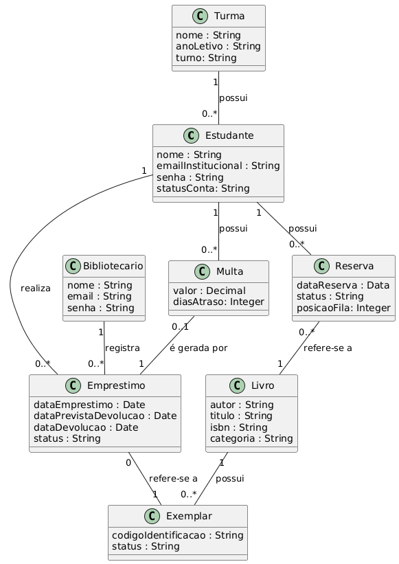

# Modelo de Domínio

O modelo de domínio representa os principais conceitos envolvidos no Sistema de Gerenciamento de Biblioteca Escolar e os relacionamentos existentes entre eles.

Foram identificadas as entidades Estudante, Turma, Bibliotecário, Livro, Exemplar, Empréstimo, Reserva e Multa.

O modelo diferencia Livro de Exemplar, considerando Livro como a obra bibliográfica e Exemplar como cada cópia física disponível na biblioteca. Também representa os relacionamentos necessários para o gerenciamento de empréstimos, reservas e multas.

